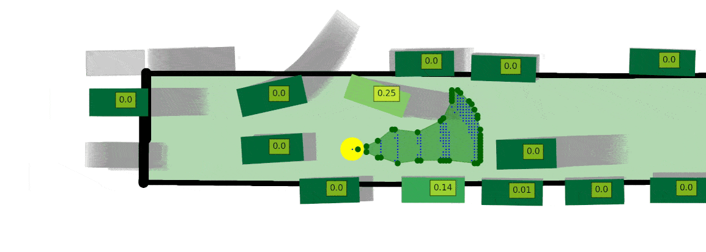

# iPrism: Characterize and Mitigate Risk by Quantifying Change in Escape Routes

*Paper accepted by [DSN 2024](https://ieeexplore.ieee.org/abstract/document/10646631)*. Introduction, visualization, and other relevant information can be found on the [project website](https://zihengjackchen.github.io/iprism-page/).


## Problem Statement

In complex and dynamic real-world situations involving multiple actors, ensuring safety is a significant challenge. This complexity often leads to severe accidents. We introduce a novel risk metric called the Safety-Threat Indicator (STI), inspired by the proactive strategies of experienced drivers who anticipate and circumvent hazards by evaluating changes in escape routes. STI outperforms state-of-the-art heuristic and data-driven techniques by 2.7 ~ 4.9 times.

To reduce STI-quantified risks and prevent accidents, we also developed a reinforcement learning-based Safety-hazard Mitigation Controller (SMC), which learns optimal policies for risk reduction. Our method improves accident rate reduction by up to 77% over previous approaches in rare but dangerous scenarios.

## Examples

STI in action: 

See the [demo](./sti_demo) folder for an example STI calculation and visit the [project website](https://zihengjackchen.github.io/iprism-page/) for more.


## File Structure Overview
- `depend_bench/` contains simulation logs and results for five safety-critical scenarios:
  - `front_accident/`
  - `ghost_cutin/`
  - `lead_cutin/`
  - `lead_slowdown/`
  - `rear_ending/`

  Each scenario includes subfolders like `SINGLE_AGENT_fi_front_accident_00000`, where one run's output is stored. Each run generates:
  - `*_ctl.csv`: Control variables — timestamp (`ts`), agent ID, throttle, steer, and brake.
  - `*_cvip.csv`: CVIP — distance from "eagle" vehicle to AV.
  - `*_piddelta.csv`: PID controller variable differences.
  - `*_traj.csv`: Absolute AV telemetry — timestamp, x/y positions, speed.
  - `*_points.csv`: Waypoint path sampled during planning.
  - `*_unclip_ctl.csv`: Unclipped control variables (e.g., values before saturation).
  - `route_highway.txt` or equivalent `.json`: Summarized simulation status including:
    - `status`: `Completed` if goal reached, otherwise `Failed`.
    - `collisions vehicles`: Non-empty if an accident occurred.
    - `infractions`: Describes safety violations even for "Completed" runs.
    - `score composed`: Ranges from <100 (if infractions) to 100.0 (perfect).
  - `done.txt`, `exitcodes.txt`, `experiment_status`: Metadata for job tracking.

- `source_code/` holds the simulation codebase:
  - `2020_CARLA_challenge/`
    - `leaderboard/team_code/image_agent.py`: Image-based LBC agent.
    - `scenario_runner/srunner/scenarios/`: Base scenarios for all 5 categories above.
    - `scripts/`, `run_agent.sh`: Runner utilities.
  - `configs/`: XML/JSON configuration files for agents and environments.
  - `sc_driver.py`, `sc_campaign_manager.py`: Main scripts to launch and sweep parameters.

- `risk_detection/` provides STI and PKL-based risk trajectory generators:
  - `bev_planning/`: STI using hard-coded rules. Core file: `generate_risk_traj_poly_single_timestamp.py`
  - `bev_planning_pkl/`: Risk estimation using ML. Key components:
    - `reachml/model/inference_driver.py`: ML model inference.
    - `reachml/model/training_driver.py`: ML model training.
  - `bev_planning_metrics/`: Variant with enhanced metrics collection.

- `risk_mitigation/` implements SMC agent logic and reinforcement learning pipelines:
  - `auto/agents/2020_CARLA_challenge/`: Agent structure compatible with leaderboard.
  - `auto/mtps_campaign_manager/`: Tools to run mitigation experiments.
  - `auto/ram_shared/`: Shared folder for trained weights.

- `sti_demo/` contains visual outputs:
  - Time-series images, actor-specific trajectory plots, and evaluation scenes.

- `weights/` stores pretrained models:
  - Models include LBC, RIP, and DQN-STI variants.
  - Weights are chunked into `*.ckpt_chunk_aa`, etc. Use `recombine_chunks.sh` to merge.

- `split_large_files.sh`: Used to chunk large model files.


## Installation

### Dependencies

- [CARLA 0.9.10](https://carla.readthedocs.io/en/0.9.10/start_quickstart/)
- [OATomobile](https://github.com/OATML/oatomobile)
- Python packages listed in `requirements.txt` files

### System Requirements

- AMD Ryzen 7 5700x
- NVIDIA GeForce GTX 1080 Ti
- 64 GB RAM
- Ubuntu 18.04.5 LTS

## Running STI Post-Processing

Run:
```bash
risk_detection/depend_bench/bev_planning/risk_driver_traj_parameter_sweeping.py <folder_name> dyn PS blocking None GT
```
Core logic:
```bash
risk_detection/depend_bench/bev_planning/generate_risk_traj_poly_single_timestamp.py
```

## Inference with SMC Agent

1. Recombine model weights using `recombine_chunks.sh`
2. Place into: `risk_mitigation/auto/ram_shared/dqn_sti_online/inference_dicts.0.pkl`
3. Modify `mitigation_inference_driver.py` to select agent
4. Run:
```bash
risk_mitigation/auto/mtps_campaign_manager/bin/mtps_campaign_manager.py \
    --config risk_mitigation/auto/mtps_campaign_manager/bin/configs/<seed_scenario>.json \
    --output_dir <folder_name> \
    --mitigation_mode <mode>
```

**Mitigation modes:**
- `none`: LBC baseline
- `smart`: LBC + SMC
- `rip`: RIP
- `rip_smc`: RIP + SMC

## Training SMC Agent

- Configure parameters under:
  - `scenario_runner/srunner/scenario_configs/`
- Train with:
  - `mitigation_rl_dqn.py` (for LBC)
  - `mitigation_rl_rip_sti.py` (for RIP)
- Output saved to `ram_shared/dqn_sti_online`

## Notes

STI also calculated from:
```
risk_detection/depend_bench/bev_planning_sim/generate_risk_traj_poly_single_timestamp_simfunction.py
```

## Example Data

- `risk_detection/`: Post-processed STI and trajectories
- `risk_mitigation/`:
  - `LBC_w_STI`: LBC + STI
  - `LBC_wo_STI`: LBC only
  - `LBC_w_TTC`: LBC + TTC
  - `RIP`: RIP agent
  - `RIP_w_STI`: RIP + STI

Vanilla LBC baseline available at [OTA repo](https://github.com/zihengjackchen/OTA).

## Related Work

- [Learning by Cheating](https://github.com/bradyz/2020_CARLA_challenge)
- [RIP](https://rowanmcallister.github.io/publication/carnovel/)
- [OATomobile](https://github.com/OATML/oatomobile)