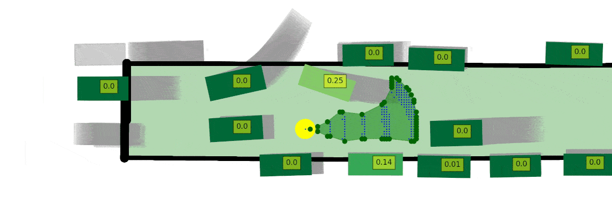

# Quantifying Risk

Run `sti_demo.py` to calculate STI on an example scenario.

## Algorithm
```python
# Reach: Compute escape routes using reach-tubes
# Inputs: M (model), X(t:t+k) (state over time), 
#         x^ego_t (ego state at time t)
# Control Constants: [a_min, a_max], [phi_min, phi_max]
# Constants: Δt (time increment), k (time horizon), 
#            N (number of samples)
# Output: T(t:t+k) (trajectory over time)

# Initialization
initCondDict = {}
initCondDict[t] = {x^ego_{t+Δt}}

# Compute reach-tube over the time horizon from t to t+k
for Δt in range(t, t+k):
    for x^ego_t in initCondDict[t]:
        sample_count = 0
        while sample_count < N:
            # Uniformly sample control inputs 
            # (acceleration a and steering angle phi)
            a, phi = sample_uniformly([a_min, a_max], 
                        [phi_min, phi_max])

            # Compute next state using the Bicycle Model
            x^ego_{t+Δt} = BicycleModel(a, phi, Δt)

            # Check for collision and boundary conditions
            if no_collision(x^ego_{t+Δt}, X_{t:t+Δt}) \
                and within_boundaries(x^ego_{t+Δt}, M):
                # Add to initial conditions if valid
                initCondDict[t+Δt].add(x^ego_{t+Δt})

            sample_count += 1

    t += Δt

# Generate bounded reach tube
T(t:t+k) = BoundedReachTube(initCondDict)

return T(t:t+k)
```

## Calculating Reach Tube

This is a bird-eye-view of the traffic where three blue cars are present. The potential states of the ego vehicle (represented as a dashed circle), starting with 0 velocity at the original position, is calculated iteratively in time steps following the bicycle model using sampled controls (accleration and steering). The reach tube is the bounding polygon of all the possible states. 

## Calculating Risks
  
To calculate the risk of each actor, we first calculate the reach tube of the ego actor removing other actor one at a time, and finally removing all the other actors. 

  
The risk of an actor posed on the ego actor is calculated counterfactually by the increase in reach tube when removing that actor. The scene risk is calculated by finding the increase in reach tube when removing all other vehicles. Risks are always normalized. 

## STI in Action
  
The above animation demonstrates the STI working in Argoverse, a real-world dataset. It shows the risk of other actors are inherently low.


  
The above animation shows STI working in ghost-cutin. The risk of the actor was detected prior to the cutting motion.